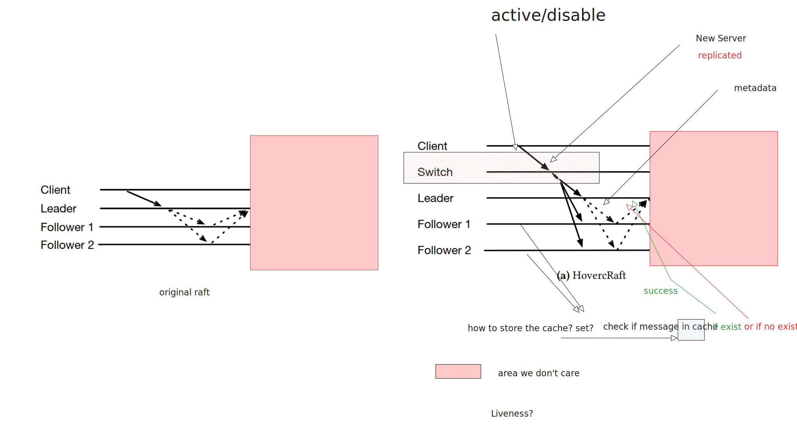

# Project Intuition
## Hints
* check `ClientRequest`
* `message: {term value payload}`
* Follower check term and value receive from the leader in cache.
* leader send appendidx to fllowers.
* log should have payload. ALso entry.
* two type of messages, cache store payload and nodes pass metadata. So payload just the partitions of original messages from client. 

# How HoverRaft Work
```plaintext
Client
   |
   | 1. Client sends full request to Switch
   v
Switch (middlebox or multicast)
   |-------------------------> Follower 1
   |-------------------------> Follower 2
   |-------------------------> Leader

(All replicas receive the same full payload from Switch)

Leader
   |
   | 2. Leader sends order: [OrderID: X, PayloadRef: H123]
   v
Followers
   | 3. Match PayloadRef H123 with locally stored payload
   v
   ✓ Append ordered log entry (OrderID X)
   ```
# Recovery mechanism(Follower check if value loss when receive from leader)
```plaintext
Follower 2 misses payload H123
         |
         | 1. Gets metadata: OrderID X, PayloadRef: H123
         v
   Cannot match → triggers recovery:
         |
         | 2. Sends recovery_request(H123)
         v
   ↪️  Leader or another Follower responds with missing H123
         |
         v
   Follower 2 reconstructs entry X
```

